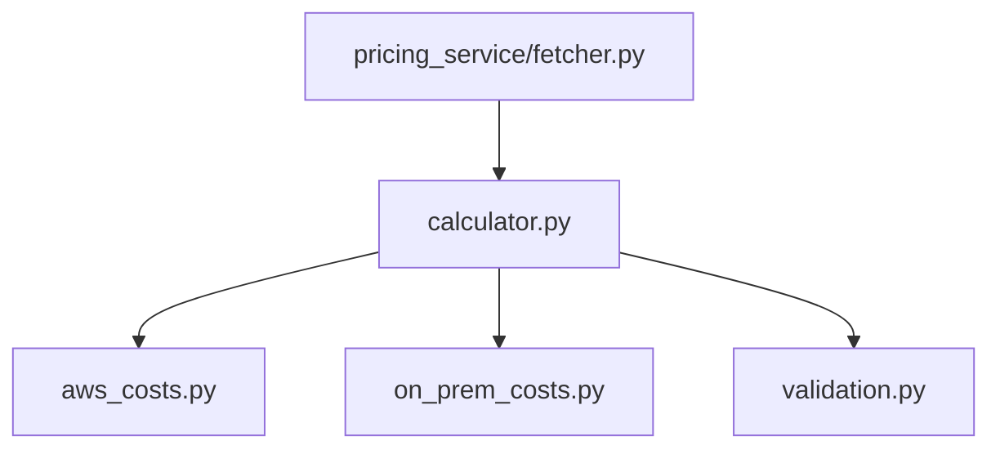

# Design Document: TCO Calculation Validation

## Overview

This design addresses six categories of improvements to the TCO calculation engine:

1. **Dead code removal** — Delete the unused `project_costs()` function from `calculator.py`
2. **gp3 IOPS billing fix** — Charge $0.005/IOPS above the 3000 free-tier threshold for gp3 volumes
3. **Unused parameter removal** — Remove `utilization_percentage` from `calculate_ec2_costs` signature
4. **S3 pricing key normalization** — Convert fetcher's uppercase S3 keys to lowercase so `aws_costs.py` lookups succeed
5. **Upper bound validation** — Add maximum value checks to `validate_configuration()`
6. **Property-based tests** — Add Hypothesis tests for non-negativity, monotonic scaling, total consistency, linear scaling, and validation completeness

All changes are localized to the `packages/tco_engine/` and `packages/pricing_service/` modules with corresponding test updates.

## Architecture

The TCO engine has a layered architecture:



Changes touch each layer independently:
- `calculator.py`: Remove `project_costs()`, stop passing `utilization_percentage` to EC2
- `aws_costs.py`: Remove `utilization_percentage` param, add gp3 IOPS charging logic
- `validation.py`: Add upper bound checks
- `pricing_service/fetcher.py`: Normalize S3 keys to lowercase

No new modules or dependencies are introduced.

## Components and Interfaces

### calculator.py Changes

**Remove `project_costs()`**: This function is dead code — `calculate_tco` computes projections inline via `_calculate_on_prem_breakdown` and `_calculate_aws_breakdown` with a `years` parameter. The function and its import in test files will be removed.

**Remove `utilization_percentage` from EC2 call**: In `_calculate_aws_breakdown`, stop passing `utilization_percentage=config.utilization_percentage` to `aws_costs.calculate_ec2_costs`.

### aws_costs.py Changes

**`calculate_ec2_costs` signature change**:
```python
def calculate_ec2_costs(
    cpu_cores: int,
    memory_gb: int,
    instance_count: int,
    operating_hours_per_month: int,
    ec2_pricing: dict[str, Decimal],
    years: int,
) -> Decimal:
```

**`calculate_ebs_costs` gp3 IOPS logic**:
```python
# Add IOPS cost for gp3 above free tier (3000 IOPS)
if storage_iops and ebs_volume_type == "gp3":
    free_tier_iops = 3000
    billable_iops = max(storage_iops - free_tier_iops, 0)
    if billable_iops > 0:
        gp3_iops_rate = Decimal("0.005")
        monthly_iops_cost = Decimal(billable_iops) * gp3_iops_rate

# Existing io2 logic remains unchanged
if storage_iops and ebs_volume_type == "io2":
    iops_rate = ebs_pricing.get("iops", Decimal("0.065"))
    monthly_iops_cost = Decimal(storage_iops) * iops_rate
```

### pricing_service/fetcher.py Changes

**`_fetch_s3_pricing`**: Convert keys to lowercase before returning:
```python
# At end of _fetch_s3_pricing:
return {k.lower(): v for k, v in s3_pricing.items()}
```

**`_get_fallback_s3_price`**: Also normalize to lowercase keys in the fallback dict, or accept lowercase input.

### validation.py Changes

Add upper bound checks for each numeric parameter:

| Parameter | Max Value |
|-----------|-----------|
| `cpu_cores` | 512 |
| `memory_gb` | 4096 |
| `instance_count` | 1000 |
| `storage_capacity_gb` | 1,000,000 |
| `storage_iops` | 256,000 |
| `bandwidth_mbps` | 100,000 |
| `monthly_data_transfer_gb` | 5,000,000 |

Each check adds an error message like: `"CPU cores must not exceed 512"`

## Data Models

No data model changes. Existing dataclasses (`Configuration`, `AWSPricing`, `CostBreakdown`, `CostLineItem`) remain unchanged. The `Configuration` dataclass retains `utilization_percentage` since on-prem calculations still use it.


## Correctness Properties

*A property is a characteristic or behavior that should hold true across all valid executions of a system — essentially, a formal statement about what the system should do. Properties serve as the bridge between human-readable specifications and machine-verifiable correctness guarantees.*

### Property 1: gp3 IOPS billing correctness

*For any* valid IOPS value and gp3 volume, the IOPS charge component of `calculate_ebs_costs` shall equal `max(0, iops - 3000) * 0.005 * 12 * years`. When IOPS ≤ 3000, the charge is zero; when IOPS > 3000, only the excess above 3000 is billed.

**Validates: Requirements 2.1, 2.2**

### Property 2: io2 IOPS billing charges all provisioned IOPS

*For any* valid IOPS value and io2 (NVME) volume, the IOPS charge component of `calculate_ebs_costs` shall equal `iops * iops_rate * 12 * years` where `iops_rate` is the "iops" key from ebs_pricing.

**Validates: Requirements 2.4**

### Property 3: EC2 cost scales linearly with instance count

*For any* valid compute configuration, doubling `instance_count` while holding all other parameters constant shall exactly double the EC2 cost returned by `calculate_ec2_costs`.

**Validates: Requirements 9.1**

### Property 4: EBS base storage cost scales linearly with capacity

*For any* valid storage configuration with no IOPS charges (storage_iops=None or gp3 with iops ≤ 3000), doubling `storage_capacity_gb` shall exactly double the EBS cost returned by `calculate_ebs_costs`.

**Validates: Requirements 9.2**

### Property 5: S3 cost scales linearly with capacity

*For any* valid storage capacity and S3 pricing, doubling `storage_capacity_gb` shall exactly double the S3 cost returned by `calculate_s3_costs`.

**Validates: Requirements 9.3**

### Property 6: S3 pricing lookup uses provided rate

*For any* valid S3 pricing dictionary with lowercase keys and any storage capacity, `calculate_s3_costs` shall return `capacity * rate * 12 * years` using the "standard" key value, never falling through to the hardcoded default of `Decimal("0.023")` when the key is present.

**Validates: Requirements 4.1, 4.3**

### Property 7: All costs are non-negative

*For any* valid Configuration and AWSPricing inputs, every individual cost line item amount and every breakdown total produced by `calculate_tco` shall be greater than or equal to zero.

**Validates: Requirements 6.1, 6.2, 6.3**

### Property 8: Monotonic multi-year scaling

*For any* valid Configuration and AWSPricing inputs, the TCO engine shall produce costs where `total(1yr) ≤ total(3yr) ≤ total(5yr)` for both on-premises and AWS breakdowns.

**Validates: Requirements 7.1, 7.2, 7.3, 7.4**

### Property 9: Total equals sum of components

*For any* valid Configuration and AWSPricing inputs and for all year periods (1, 3, 5), the `CostBreakdown.total` shall exactly equal the sum of all `CostLineItem.amount` values in that breakdown, for both on-premises and AWS calculations.

**Validates: Requirements 8.1, 8.2**

### Property 10: Validation rejects all out-of-range inputs

*For any* integer value outside the valid range for a given parameter (below minimum or above maximum), `validate_configuration` shall raise a `ValidationError` containing that parameter's field name.

**Validates: Requirements 5.1, 5.2, 5.3, 5.4, 5.5, 5.6, 5.7, 10.1**

### Property 11: Validation accepts all in-range inputs

*For any* integer value within the valid range for each parameter (including boundary values), `validate_configuration` shall not raise a `ValidationError` for that parameter.

**Validates: Requirements 10.2**

### Property 12: Validation rejects invalid storage types

*For any* string that is not one of "SSD", "HDD", or "NVME", `validate_configuration` shall raise a `ValidationError` with "storage_type" in the errors dictionary.

**Validates: Requirements 10.3**

## Error Handling

- **gp3 IOPS with None**: When `storage_iops` is `None`, no IOPS calculation is attempted (guarded by `if storage_iops` check). No error raised.
- **Missing S3 pricing key**: After normalization, if the "standard" key is somehow missing, the existing fallback `Decimal("0.023")` in `s3_pricing.get("standard", Decimal("0.023"))` still applies. This is defense-in-depth.
- **Upper bound validation**: Returns descriptive error messages (e.g., "CPU cores must not exceed 512") collected in the errors dict, then raises `ValidationError` with all errors at once (existing pattern preserved).
- **Removed `project_costs` callers**: Any test importing `project_costs` will get an `ImportError` at test collection time, making breakage immediately visible. Tests referencing it must be updated or removed.

## Testing Strategy

### Unit Tests

Update existing unit tests to reflect the changes:

- **test_calculator.py**: Remove tests for `project_costs()`. Remove `project_costs` from imports. Update `sample_config` fixture if needed (it still has `utilization_percentage` for on-prem use).
- **test_aws_costs.py**: Update `calculate_ec2_costs` calls to remove `utilization_percentage` parameter. Add tests for gp3 IOPS charging (above and below 3000 threshold).
- **test_validation.py**: Add tests for upper bound violations (cpu_cores=513, memory_gb=4097, etc.) and boundary acceptance (cpu_cores=512, memory_gb=4096, etc.).

### Property-Based Tests

Use the **Hypothesis** library (already installed). Tests go in `tests/property/`.

Each property test:
- Runs minimum **100 iterations** (Hypothesis default is 100 examples)
- References its design property via a comment tag
- Uses `@settings(max_examples=200)` for extra confidence on critical properties

**Test file**: `tests/property/test_tco_properties.py`

Property test tag format:
```python
# Feature: tco-calculation-validation, Property 1: gp3 IOPS billing correctness
```

**Generators needed**:
- `valid_configuration()` — generates `Configuration` with all fields in valid ranges (respecting new upper bounds)
- `valid_aws_pricing()` — generates `AWSPricing` with realistic rate ranges
- `valid_iops(min_val, max_val)` — generates IOPS values in specified range
- `valid_storage_capacity()` — generates capacity values that won't overflow when doubled

**Library**: `hypothesis` with `hypothesis.strategies` — no custom PBT framework.
